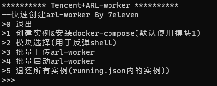

# Tencent-arl
## 介绍

基于腾讯云sdk快速搭建arl分布式worker

用于攻防中利用arl快速信息搜集的

## 使用

- 拥有一个腾讯云账号
- 在腾讯云上充值5-10元
- 在访问控制中获取你的 SecretID 和 SecretKey，[获取AKSK](https://console.cloud.tencent.com/cam/capi)
- 配置公私钥实现免密登录

- clone 本项目

```
git clone https://github.com/7-e1even/Tencent-arl.git
```

- clone arl分布式项目

```
git clone https://github.com/1c3z/ARL-Distributed.git
```

- 将 SecretID 和 SecretKey 写入`cred`文件下，格式如下：

```
{ 
    "SecretId": "",
    "SecretKey": "",
    "Password":"r00t@Tencent",
    "Description": "Password 是实例主机启动密码，需要包含大小写字母、数字和特殊字符，长度8-30位。默认为 r00t@Tencent , 建议修改，推荐配置公私钥实现免密登录"
}
```


- 开一台服务器用于部署master(需手动)🥲
- 使用请修改`ARL-Distributed/master/docker-compose.yml` 中配置的`mongo` 和`rabbitmq`密码。
  并同步修改`config-docker.yaml` 中的`mongo`和 `rabbitmq` 密码
  以及将`arl-master` 修改为 `Master` 对应的公网IP, 并允许能通过公网访问到`5003`，`27017`、`5672` 端口
- 启动并观察是否生效

```
cd ARL-Distributed/master
docker-compose up -d
docker-compose ps
```

- 并同步修改 `ARL-Distributed/worker/config-docker.yaml` 中的mongo和 rabbitmq 密码
  以及将`arl-master`修改为`Master`对应的公网IP, 并确保Worker能访问到Master 的 `5003`，`27017`、`5672` 端口

- 安装依赖
- 具体安装可参考：https://cloud.tencent.com/document/sdk/Python

```
pip install -r requirements.txt
```

- 运行

```
python main.py
```



#### 步骤：

`创建实例&安装docker-compose(默认使用模块1)`->`批量上传arl-worker`->`批量启动arl-worker`

------

## 🙇‍♂️感谢

代码改自：https://github.com/ProbiusOfficial/Hello_CTF-Shell

基础工具：https://github.com/TophantTechnology/ARL
